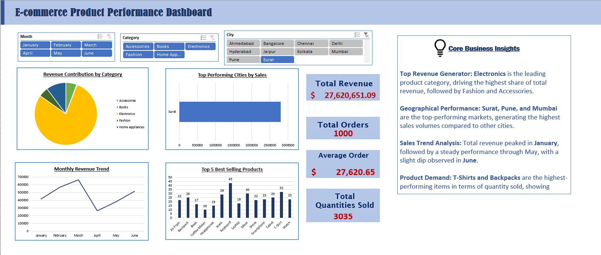

# E-Commerce Product Performance Dashboard
An interactive Excel Dashboard designed to analyze e-commerce sales
performance, track key business metrics (KPIs), and identify top-performing
products and regions.
## Key Features & Insights Included:
* **Dynamic KPI Cards:** Displays Total Revenue, Total Orders, Average Order
Value (AOV), and Total Quantities Sold.
* **Monthly Revenue Trend:** A line chart visualization tracking business
growth and sales fluctuations from January to June.
* **Product Performance Analysis:** Identifies the top-selling products
based on quantity sold.
* **Regional Sales Distribution:** Highlights the top-performing cities
driving the highest sales volume.
* **Interactive Slicers:** Allows users to dynamically filter the entire
dashboard by Month, Product Category, and City with a single click.
## Core Business Insights:
* **Top Revenue Generator:** **Electronics** is the leading product
category, driving the highest share of total revenue, followed by Fashion
and Accessories.

* **Geographical Performance:** **Surat, Pune, and Mumbai** are the top-
performing markets, generating the highest sales volumes.

* **Sales Trend Analysis:** Total revenue peaked in **January**, followed by
a steady performance through May, with a slight dip observed in **June**.
* **Product Demand:** **T-Shirts and Backpacks** are the highest-performing
items in terms of quantity sold, showing strong customer demand.
## Tech Stack Used:
* **Tool:** Microsoft Excel
* **Features:** Pivot Tables, Pivot Charts, Slicers, Advanced Formulas,
Dashboard UI/UX Design.
## Dashboard Preview:

## Project Structure:
* `E-commerce_Sales_Analysis.xlsx` - The main Excel file containing raw data, pivot tables, and the final interactive dashboard.
* `README.md` - Project documentation.
